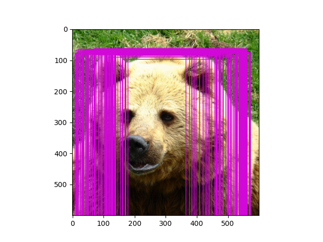

# DETR Pytorch

### official-code : https://github.com/facebookresearch/detr

### KOR code comment : https://github.com/nuggy875/note-DETR-official

### paper : https://arxiv.org/abs/2005.12872

- [x] Dataset
  - [x] Nested Tensor 분석 -> resize를 600x600로 구성
  - [x] Loss에 들어가는 GT를 어떻게 변형하는지 확인 (공집합 등)
  - [ ] Data Augmentation (Random Crop)
- [x] Model
  - [x] 구조 이해
  - [x] Backbone (ResNet50 + Positional Encoding)
    - [ ] Positional Encoding 분석
  - [x] Transformer Encoder
  - [x] Transformer Decoder
  - [ ] TEST
- [x] Loss (Criterion)
  - [x] Matcher (scipy.optimizer, Hungarian Algorithm)
  - [x] Hungarian Loss (loss label, boxes loss, cardinality loss)
  - [x] Check versus original loss
- [ ] Training
  - [x] Find training epoch, batch, lr
  - [ ] Compare optimizer for Transformer with Backbone

```
***** configuration *****
optimizer        : AdamW
lr               : 1e-4(Transformer) / 1e-5(Backbone)
weight decay     : 1e-4
initialzation    : Xavier(uniform)
lr scheduler     : StepLR(at 200 epoch) - gamma 0.1
batch size       : 64
batch size / GPU : 4 
num_GPU (paper)  : 16 V100
Traning epoch    : 300
```
  
epoch 3 일때 test 사진


